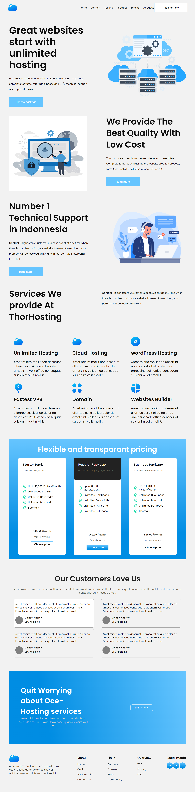

# _Project_ | _SAAS Hosting_  

_by Tasmiya 💗_

### _Live Link_ -: [SAAS Hosting](https://tasmiya-proj-11.netlify.app)

## Technologies used

- HTML
- CSS

## 💡 What I have learn ?

- learned about positioning
- learned about flexbox
- leaned indepth about media query.

## Time taken to Finish this project

- This project took around 6 hours to complete 😊.
